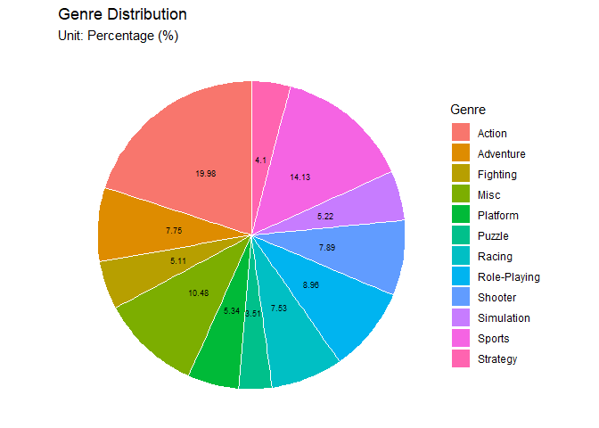

# EDA-for-video-games-sales-dataset
Object this project to create a sample Exploratory Data Analysis using R and use libraries like dplyr, tidyverse, and ggplot2. This project includes data handling, EDA using descriptive statistics and data visualization


# I. Introduction

The report’s objective is to describe a dataset named “game” (Video Game
Sales). We separate the report into two parts, including Exploratory
Data Analysis and Data Visualization. In the first part, we summarize
and discuss the dataset, consisting of subsections such as “About the
dataset”, “Descriptive Statistics”, and “Handling Data”. In the second
part, we dig in the characteristics of each variable and consider their
relationships through visualization.

In the report, we show off our reflection of the lecture by combining
three main parts: Basic R (about calculation and variables), Data
manipulation (Using dplyr), and Data visualization (Using ggplot and
theme).

# II. Exploratory Data Analysis

## 1. About the dataset

``` r
table<-data.frame(
  Order=c(1,2,3,4,5,6,7,8,9,10,11),
  Variable_Name=c("Rank","Name", "Platform","Year", "Genre", "Publisher", "NA_Sales", "EU_Sales","JP_Sales", "Other_Sales", "Global_Sales"),
  Type= c("Factor","Factor", "Factor", "Factor", "Factor", "Factor", "Numeric", "Numeric", "Numeric", "Numeric", "Numeric"),
  Label_Description=c("The rank in total sales of the game","The name of the game", "The platform where the game was built in", "The year when the game was released", "The genre of the game", "The publisher of the game", "Sales of the game in North America", "Sales of the game in EU", "Sales of the game in Japan","Sales of the game in Other place", "Sales of the game in total")
)
kbl(table, caption = "Data “game” (Video Game Sales) label and description")%>%
row_spec(row =0, bold= TRUE, color = "black", background = "#F9EBEA") %>%
kable_styling(bootstrap_options = c("striped", "hover", "bordered"), full_width = F, position = "center")
```

<table class="table table-striped table-hover table-bordered" style="width: auto !important; margin-left: auto; margin-right: auto;">
<caption>
Data “game” (Video Game Sales) label and description
</caption>
<thead>
<tr>
<th style="text-align:right;font-weight: bold;color: black !important;background-color: #F9EBEA !important;">
Order
</th>
<th style="text-align:left;font-weight: bold;color: black !important;background-color: #F9EBEA !important;">
Variable_Name
</th>
<th style="text-align:left;font-weight: bold;color: black !important;background-color: #F9EBEA !important;">
Type
</th>
<th style="text-align:left;font-weight: bold;color: black !important;background-color: #F9EBEA !important;">
Label_Description
</th>
</tr>
</thead>
<tbody>
<tr>
<td style="text-align:right;">
1
</td>
<td style="text-align:left;">
Rank
</td>
<td style="text-align:left;">
Factor
</td>
<td style="text-align:left;">
The rank in total sales of the game
</td>
</tr>
<tr>
<td style="text-align:right;">
2
</td>
<td style="text-align:left;">
Name
</td>
<td style="text-align:left;">
Factor
</td>
<td style="text-align:left;">
The name of the game
</td>
</tr>
<tr>
<td style="text-align:right;">
3
</td>
<td style="text-align:left;">
Platform
</td>
<td style="text-align:left;">
Factor
</td>
<td style="text-align:left;">
The platform where the game was built in
</td>
</tr>
<tr>
<td style="text-align:right;">
4
</td>
<td style="text-align:left;">
Year
</td>
<td style="text-align:left;">
Factor
</td>
<td style="text-align:left;">
The year when the game was released
</td>
</tr>
<tr>
<td style="text-align:right;">
5
</td>
<td style="text-align:left;">
Genre
</td>
<td style="text-align:left;">
Factor
</td>
<td style="text-align:left;">
The genre of the game
</td>
</tr>
<tr>
<td style="text-align:right;">
6
</td>
<td style="text-align:left;">
Publisher
</td>
<td style="text-align:left;">
Factor
</td>
<td style="text-align:left;">
The publisher of the game
</td>
</tr>
<tr>
<td style="text-align:right;">
7
</td>
<td style="text-align:left;">
NA_Sales
</td>
<td style="text-align:left;">
Numeric
</td>
<td style="text-align:left;">
Sales of the game in North America
</td>
</tr>
<tr>
<td style="text-align:right;">
8
</td>
<td style="text-align:left;">
EU_Sales
</td>
<td style="text-align:left;">
Numeric
</td>
<td style="text-align:left;">
Sales of the game in EU
</td>
</tr>
<tr>
<td style="text-align:right;">
9
</td>
<td style="text-align:left;">
JP_Sales
</td>
<td style="text-align:left;">
Numeric
</td>
<td style="text-align:left;">
Sales of the game in Japan
</td>
</tr>
<tr>
<td style="text-align:right;">
10
</td>
<td style="text-align:left;">
Other_Sales
</td>
<td style="text-align:left;">
Numeric
</td>
<td style="text-align:left;">
Sales of the game in Other place
</td>
</tr>
<tr>
<td style="text-align:right;">
11
</td>
<td style="text-align:left;">
Global_Sales
</td>
<td style="text-align:left;">
Numeric
</td>
<td style="text-align:left;">
Sales of the game in total
</td>
</tr>
</tbody>
</table>

The dataset “game” is first generated by the raw data in
[vgchartz](https://www.vgchartz.com/) and then it was collected and
formatted in kaggle. It was first posted in kaggle in 2016, then was
continuously updated till 2020. The dataset was about the new game
released with some additional information, presented by 11 variables and
16,598 observations. The table 1 depicts variables’ name, type and short
description. As can be seen from the table, there are 6 categorical
variables and 5 numeric variables.

## 2. Descriptive Statistics

``` r
table1<-data.frame(
  Numeric_variables=c("Sales of the game in North America", "Sales of the game in EU", "Sales of the game in Japan","Sales of the game in Other place", "Sales of the game in total"),
  Min=c("0","0","0","0","0.01"),
  Mean=c("0.2647","0.1467","0.07778","0.04806","0.5374"),
  Max=c("41.49","29.02","10.22","10.57","82.74"),
  NAs=c("0","0","0","0","0")
)
kbl(table1, caption = "Descriptive statistics of continuous variables") %>%
  row_spec(row =0, bold= TRUE, color = "black", background = "#F9EBEA") %>%
  kable_styling(bootstrap_options = c("striped", "hover", "bordered"), full_width = F, position = "center")
```

<table class="table table-striped table-hover table-bordered" style="width: auto !important; margin-left: auto; margin-right: auto;">
<caption>
Descriptive statistics of continuous variables
</caption>
<thead>
<tr>
<th style="text-align:left;font-weight: bold;color: black !important;background-color: #F9EBEA !important;">
Numeric_variables
</th>
<th style="text-align:left;font-weight: bold;color: black !important;background-color: #F9EBEA !important;">
Min
</th>
<th style="text-align:left;font-weight: bold;color: black !important;background-color: #F9EBEA !important;">
Mean
</th>
<th style="text-align:left;font-weight: bold;color: black !important;background-color: #F9EBEA !important;">
Max
</th>
<th style="text-align:left;font-weight: bold;color: black !important;background-color: #F9EBEA !important;">
NAs
</th>
</tr>
</thead>
<tbody>
<tr>
<td style="text-align:left;">
Sales of the game in North America
</td>
<td style="text-align:left;">
0
</td>
<td style="text-align:left;">
0.2647
</td>
<td style="text-align:left;">
41.49
</td>
<td style="text-align:left;">
0
</td>
</tr>
<tr>
<td style="text-align:left;">
Sales of the game in EU
</td>
<td style="text-align:left;">
0
</td>
<td style="text-align:left;">
0.1467
</td>
<td style="text-align:left;">
29.02
</td>
<td style="text-align:left;">
0
</td>
</tr>
<tr>
<td style="text-align:left;">
Sales of the game in Japan
</td>
<td style="text-align:left;">
0
</td>
<td style="text-align:left;">
0.07778
</td>
<td style="text-align:left;">
10.22
</td>
<td style="text-align:left;">
0
</td>
</tr>
<tr>
<td style="text-align:left;">
Sales of the game in Other place
</td>
<td style="text-align:left;">
0
</td>
<td style="text-align:left;">
0.04806
</td>
<td style="text-align:left;">
10.57
</td>
<td style="text-align:left;">
0
</td>
</tr>
<tr>
<td style="text-align:left;">
Sales of the game in total
</td>
<td style="text-align:left;">
0.01
</td>
<td style="text-align:left;">
0.5374
</td>
<td style="text-align:left;">
82.74
</td>
<td style="text-align:left;">
0
</td>
</tr>
</tbody>
</table>

Regarding numeric variables, they are about the sales in North America,
EU, Japan, the rest of the world, and global, which are all measured in
millions dollar units. The data is quite clean while there are no N/A
(not available) values. The global sales are considered as sum of sales
in North America, EU, Japan and the rest of the world; Hence, while the
min values of all four other variable are equal 0, the min value of
Global sales is 0.01 million dollars (definitely different from 0
because when global sales = 0, it will not appear in the dataset). Mean
is identified as the average amount of sales from 1980 to 2020. The mean
sales in North America, EU, Japan and other places are 0.2647, 0.1467,
0.0778, 0.0481, respectively. Summing up all the stated numbers in
total, we have the mean global sales at 0.5374 million dollars. North
America sales have the max value at 41.49 million dollars, which is 1.43
times larger than that in the EU (29.02). The maximum value in sales in
Japan and the rest of the world are approximately similar at 10.22 and
10.57, respectively. The maximum value of global sales are at 82.74,
nearly double that of North America.

``` r
table2<-data.frame(
  Category=c("DS","PS2","PS3","Wii","X360","PSP","PS","PC","XB","GBA","GC","3DS", "PSV","PS4","N64","SNES","XOne","SAT","WiiU","2600","GB","NES","DC","GEN","NG","SCD","WS","3DO","TG16","GG","PCFX", "Action","Sports","Misc","Role-Playing","Shooter","Adventure","Racing","Platform","Simulation","Fighting","strategy","Puzzle","2009","2008","2010","2007","2011","2006","2005","2002","2003","2004","2012","2015","2014","2013","2001","1998","2000","2016","1999","1997","N/A","1996","1995","1994","1993","1981","1992","1991","1982","1986","1983","1989","1987","1990","1988","1984","1985","1980","2017","2020","including 579 unique values"),
  Count=c("2163","2161","1329","1325","1265","1213","1196","960","824","822","556","509","413","336","319","239","213","173","143", "133","98","98","52","27","12","6","6","3","2","1","1","3316","2346","1739","1488","1310","1286","1249","886","867","848","681","582","1431","1428","1259","1202","1139","1008","941","829","775","763","657","614","582","546","482","379","349","344","338","289","271","263","219","121","60","46","43","41","36","21","17","17","16","16","15","14","14","9","3","1",""),
  Frequency=c("13.03%","13.02%","8.01%","7.98%","7.62%","7.31%","7.21%","5.78%","4.96%","4.95%","3.35%","3.07%","2.49%","2.02%","1.92%","1.44%","1.28%","1.04%","0.86%","0.80%","0.59%","0.59%","0.31%","0.16%","0.07%","0.04%","0.04%","0.02%","0.01%","0.01%","0.01%","19.98%","14.13%","10.48%","8.96%","7.89%","7.75%","7.53%","5.34%","5.22%","5.11%","4.10%","3.51%","8.62%","8.60%","7.59%","7.24%","6.86%","6.07%","5.67%","4.99%","4.67%","4.60%","3.96%","3.70%","3.51%","3.29%","2.90%","2.28%","2.10%","2.07%","2.04%","1.74%","1.63%","1.58%","1.32%","0.73%","0.36%","0.28%","0.26%","0.25%","0.22%","0.13%","0.10%","0.10%","0.10%","0.10%","0.09%","0.08%","0.08%","0.05%","0.02%","0.01%",""))

kbl(table2, caption = "Descriptive statistics of categorical variables") %>%
  kable_classic(html_font = "Sans-Serif") %>%
  kable_styling(bootstrap_options = c("striped", "hover", "bordered"), full_width = F, position = "center") %>%
  row_spec(row =0, bold= TRUE, color = "black", background = "#F9EBEA") %>%
  pack_rows("Platform (31 unique values)", 1,31) %>%
  pack_rows("Genre (12 unique values)", 32, 43) %>%
  pack_rows("Year (40 unique values)", 44, 83) %>%
  pack_rows("Publisher", 84,84) %>%
  scroll_box(width = "100%", height = "300px", fixed_thead = TRUE)
```

<div
style="border: 1px solid #ddd; padding: 0px; overflow-y: scroll; height:300px; overflow-x: scroll; width:100%; ">

<table class=" lightable-classic table table-striped table-hover table-bordered" style="font-family: Sans-Serif; margin-left: auto; margin-right: auto; width: auto !important; margin-left: auto; margin-right: auto;">
<caption>
Descriptive statistics of categorical variables
</caption>
<thead>
<tr>
<th style="text-align:left;font-weight: bold;color: black !important;background-color: #F9EBEA !important;position: sticky; top:0; background-color: #FFFFFF;">
Category
</th>
<th style="text-align:left;font-weight: bold;color: black !important;background-color: #F9EBEA !important;position: sticky; top:0; background-color: #FFFFFF;">
Count
</th>
<th style="text-align:left;font-weight: bold;color: black !important;background-color: #F9EBEA !important;position: sticky; top:0; background-color: #FFFFFF;">
Frequency
</th>
</tr>
</thead>
<tbody>
<tr grouplength="31">
<td colspan="3" style="border-bottom: 0;">
<strong>Platform (31 unique values)</strong>
</td>
</tr>
<tr>
<td style="text-align:left;padding-left: 2em;" indentlevel="1">
DS
</td>
<td style="text-align:left;">
2163
</td>
<td style="text-align:left;">
13.03%
</td>
</tr>
<tr>
<td style="text-align:left;padding-left: 2em;" indentlevel="1">
PS2
</td>
<td style="text-align:left;">
2161
</td>
<td style="text-align:left;">
13.02%
</td>
</tr>
<tr>
<td style="text-align:left;padding-left: 2em;" indentlevel="1">
PS3
</td>
<td style="text-align:left;">
1329
</td>
<td style="text-align:left;">
8.01%
</td>
</tr>
<tr>
<td style="text-align:left;padding-left: 2em;" indentlevel="1">
Wii
</td>
<td style="text-align:left;">
1325
</td>
<td style="text-align:left;">
7.98%
</td>
</tr>
<tr>
<td style="text-align:left;padding-left: 2em;" indentlevel="1">
X360
</td>
<td style="text-align:left;">
1265
</td>
<td style="text-align:left;">
7.62%
</td>
</tr>
<tr>
<td style="text-align:left;padding-left: 2em;" indentlevel="1">
PSP
</td>
<td style="text-align:left;">
1213
</td>
<td style="text-align:left;">
7.31%
</td>
</tr>
<tr>
<td style="text-align:left;padding-left: 2em;" indentlevel="1">
PS
</td>
<td style="text-align:left;">
1196
</td>
<td style="text-align:left;">
7.21%
</td>
</tr>
<tr>
<td style="text-align:left;padding-left: 2em;" indentlevel="1">
PC
</td>
<td style="text-align:left;">
960
</td>
<td style="text-align:left;">
5.78%
</td>
</tr>
<tr>
<td style="text-align:left;padding-left: 2em;" indentlevel="1">
XB
</td>
<td style="text-align:left;">
824
</td>
<td style="text-align:left;">
4.96%
</td>
</tr>
<tr>
<td style="text-align:left;padding-left: 2em;" indentlevel="1">
GBA
</td>
<td style="text-align:left;">
822
</td>
<td style="text-align:left;">
4.95%
</td>
</tr>
<tr>
<td style="text-align:left;padding-left: 2em;" indentlevel="1">
GC
</td>
<td style="text-align:left;">
556
</td>
<td style="text-align:left;">
3.35%
</td>
</tr>
<tr>
<td style="text-align:left;padding-left: 2em;" indentlevel="1">
3DS
</td>
<td style="text-align:left;">
509
</td>
<td style="text-align:left;">
3.07%
</td>
</tr>
<tr>
<td style="text-align:left;padding-left: 2em;" indentlevel="1">
PSV
</td>
<td style="text-align:left;">
413
</td>
<td style="text-align:left;">
2.49%
</td>
</tr>
<tr>
<td style="text-align:left;padding-left: 2em;" indentlevel="1">
PS4
</td>
<td style="text-align:left;">
336
</td>
<td style="text-align:left;">
2.02%
</td>
</tr>
<tr>
<td style="text-align:left;padding-left: 2em;" indentlevel="1">
N64
</td>
<td style="text-align:left;">
319
</td>
<td style="text-align:left;">
1.92%
</td>
</tr>
<tr>
<td style="text-align:left;padding-left: 2em;" indentlevel="1">
SNES
</td>
<td style="text-align:left;">
239
</td>
<td style="text-align:left;">
1.44%
</td>
</tr>
<tr>
<td style="text-align:left;padding-left: 2em;" indentlevel="1">
XOne
</td>
<td style="text-align:left;">
213
</td>
<td style="text-align:left;">
1.28%
</td>
</tr>
<tr>
<td style="text-align:left;padding-left: 2em;" indentlevel="1">
SAT
</td>
<td style="text-align:left;">
173
</td>
<td style="text-align:left;">
1.04%
</td>
</tr>
<tr>
<td style="text-align:left;padding-left: 2em;" indentlevel="1">
WiiU
</td>
<td style="text-align:left;">
143
</td>
<td style="text-align:left;">
0.86%
</td>
</tr>
<tr>
<td style="text-align:left;padding-left: 2em;" indentlevel="1">
2600
</td>
<td style="text-align:left;">
133
</td>
<td style="text-align:left;">
0.80%
</td>
</tr>
<tr>
<td style="text-align:left;padding-left: 2em;" indentlevel="1">
GB
</td>
<td style="text-align:left;">
98
</td>
<td style="text-align:left;">
0.59%
</td>
</tr>
<tr>
<td style="text-align:left;padding-left: 2em;" indentlevel="1">
NES
</td>
<td style="text-align:left;">
98
</td>
<td style="text-align:left;">
0.59%
</td>
</tr>
<tr>
<td style="text-align:left;padding-left: 2em;" indentlevel="1">
DC
</td>
<td style="text-align:left;">
52
</td>
<td style="text-align:left;">
0.31%
</td>
</tr>
<tr>
<td style="text-align:left;padding-left: 2em;" indentlevel="1">
GEN
</td>
<td style="text-align:left;">
27
</td>
<td style="text-align:left;">
0.16%
</td>
</tr>
<tr>
<td style="text-align:left;padding-left: 2em;" indentlevel="1">
NG
</td>
<td style="text-align:left;">
12
</td>
<td style="text-align:left;">
0.07%
</td>
</tr>
<tr>
<td style="text-align:left;padding-left: 2em;" indentlevel="1">
SCD
</td>
<td style="text-align:left;">
6
</td>
<td style="text-align:left;">
0.04%
</td>
</tr>
<tr>
<td style="text-align:left;padding-left: 2em;" indentlevel="1">
WS
</td>
<td style="text-align:left;">
6
</td>
<td style="text-align:left;">
0.04%
</td>
</tr>
<tr>
<td style="text-align:left;padding-left: 2em;" indentlevel="1">
3DO
</td>
<td style="text-align:left;">
3
</td>
<td style="text-align:left;">
0.02%
</td>
</tr>
<tr>
<td style="text-align:left;padding-left: 2em;" indentlevel="1">
TG16
</td>
<td style="text-align:left;">
2
</td>
<td style="text-align:left;">
0.01%
</td>
</tr>
<tr>
<td style="text-align:left;padding-left: 2em;" indentlevel="1">
GG
</td>
<td style="text-align:left;">
1
</td>
<td style="text-align:left;">
0.01%
</td>
</tr>
<tr>
<td style="text-align:left;padding-left: 2em;" indentlevel="1">
PCFX
</td>
<td style="text-align:left;">
1
</td>
<td style="text-align:left;">
0.01%
</td>
</tr>
<tr grouplength="12">
<td colspan="3" style="border-bottom: 0;">
<strong>Genre (12 unique values)</strong>
</td>
</tr>
<tr>
<td style="text-align:left;padding-left: 2em;" indentlevel="1">
Action
</td>
<td style="text-align:left;">
3316
</td>
<td style="text-align:left;">
19.98%
</td>
</tr>
<tr>
<td style="text-align:left;padding-left: 2em;" indentlevel="1">
Sports
</td>
<td style="text-align:left;">
2346
</td>
<td style="text-align:left;">
14.13%
</td>
</tr>
<tr>
<td style="text-align:left;padding-left: 2em;" indentlevel="1">
Misc
</td>
<td style="text-align:left;">
1739
</td>
<td style="text-align:left;">
10.48%
</td>
</tr>
<tr>
<td style="text-align:left;padding-left: 2em;" indentlevel="1">
Role-Playing
</td>
<td style="text-align:left;">
1488
</td>
<td style="text-align:left;">
8.96%
</td>
</tr>
<tr>
<td style="text-align:left;padding-left: 2em;" indentlevel="1">
Shooter
</td>
<td style="text-align:left;">
1310
</td>
<td style="text-align:left;">
7.89%
</td>
</tr>
<tr>
<td style="text-align:left;padding-left: 2em;" indentlevel="1">
Adventure
</td>
<td style="text-align:left;">
1286
</td>
<td style="text-align:left;">
7.75%
</td>
</tr>
<tr>
<td style="text-align:left;padding-left: 2em;" indentlevel="1">
Racing
</td>
<td style="text-align:left;">
1249
</td>
<td style="text-align:left;">
7.53%
</td>
</tr>
<tr>
<td style="text-align:left;padding-left: 2em;" indentlevel="1">
Platform
</td>
<td style="text-align:left;">
886
</td>
<td style="text-align:left;">
5.34%
</td>
</tr>
<tr>
<td style="text-align:left;padding-left: 2em;" indentlevel="1">
Simulation
</td>
<td style="text-align:left;">
867
</td>
<td style="text-align:left;">
5.22%
</td>
</tr>
<tr>
<td style="text-align:left;padding-left: 2em;" indentlevel="1">
Fighting
</td>
<td style="text-align:left;">
848
</td>
<td style="text-align:left;">
5.11%
</td>
</tr>
<tr>
<td style="text-align:left;padding-left: 2em;" indentlevel="1">
strategy
</td>
<td style="text-align:left;">
681
</td>
<td style="text-align:left;">
4.10%
</td>
</tr>
<tr>
<td style="text-align:left;padding-left: 2em;" indentlevel="1">
Puzzle
</td>
<td style="text-align:left;">
582
</td>
<td style="text-align:left;">
3.51%
</td>
</tr>
<tr grouplength="40">
<td colspan="3" style="border-bottom: 0;">
<strong>Year (40 unique values)</strong>
</td>
</tr>
<tr>
<td style="text-align:left;padding-left: 2em;" indentlevel="1">
2009
</td>
<td style="text-align:left;">
1431
</td>
<td style="text-align:left;">
8.62%
</td>
</tr>
<tr>
<td style="text-align:left;padding-left: 2em;" indentlevel="1">
2008
</td>
<td style="text-align:left;">
1428
</td>
<td style="text-align:left;">
8.60%
</td>
</tr>
<tr>
<td style="text-align:left;padding-left: 2em;" indentlevel="1">
2010
</td>
<td style="text-align:left;">
1259
</td>
<td style="text-align:left;">
7.59%
</td>
</tr>
<tr>
<td style="text-align:left;padding-left: 2em;" indentlevel="1">
2007
</td>
<td style="text-align:left;">
1202
</td>
<td style="text-align:left;">
7.24%
</td>
</tr>
<tr>
<td style="text-align:left;padding-left: 2em;" indentlevel="1">
2011
</td>
<td style="text-align:left;">
1139
</td>
<td style="text-align:left;">
6.86%
</td>
</tr>
<tr>
<td style="text-align:left;padding-left: 2em;" indentlevel="1">
2006
</td>
<td style="text-align:left;">
1008
</td>
<td style="text-align:left;">
6.07%
</td>
</tr>
<tr>
<td style="text-align:left;padding-left: 2em;" indentlevel="1">
2005
</td>
<td style="text-align:left;">
941
</td>
<td style="text-align:left;">
5.67%
</td>
</tr>
<tr>
<td style="text-align:left;padding-left: 2em;" indentlevel="1">
2002
</td>
<td style="text-align:left;">
829
</td>
<td style="text-align:left;">
4.99%
</td>
</tr>
<tr>
<td style="text-align:left;padding-left: 2em;" indentlevel="1">
2003
</td>
<td style="text-align:left;">
775
</td>
<td style="text-align:left;">
4.67%
</td>
</tr>
<tr>
<td style="text-align:left;padding-left: 2em;" indentlevel="1">
2004
</td>
<td style="text-align:left;">
763
</td>
<td style="text-align:left;">
4.60%
</td>
</tr>
<tr>
<td style="text-align:left;padding-left: 2em;" indentlevel="1">
2012
</td>
<td style="text-align:left;">
657
</td>
<td style="text-align:left;">
3.96%
</td>
</tr>
<tr>
<td style="text-align:left;padding-left: 2em;" indentlevel="1">
2015
</td>
<td style="text-align:left;">
614
</td>
<td style="text-align:left;">
3.70%
</td>
</tr>
<tr>
<td style="text-align:left;padding-left: 2em;" indentlevel="1">
2014
</td>
<td style="text-align:left;">
582
</td>
<td style="text-align:left;">
3.51%
</td>
</tr>
<tr>
<td style="text-align:left;padding-left: 2em;" indentlevel="1">
2013
</td>
<td style="text-align:left;">
546
</td>
<td style="text-align:left;">
3.29%
</td>
</tr>
<tr>
<td style="text-align:left;padding-left: 2em;" indentlevel="1">
2001
</td>
<td style="text-align:left;">
482
</td>
<td style="text-align:left;">
2.90%
</td>
</tr>
<tr>
<td style="text-align:left;padding-left: 2em;" indentlevel="1">
1998
</td>
<td style="text-align:left;">
379
</td>
<td style="text-align:left;">
2.28%
</td>
</tr>
<tr>
<td style="text-align:left;padding-left: 2em;" indentlevel="1">
2000
</td>
<td style="text-align:left;">
349
</td>
<td style="text-align:left;">
2.10%
</td>
</tr>
<tr>
<td style="text-align:left;padding-left: 2em;" indentlevel="1">
2016
</td>
<td style="text-align:left;">
344
</td>
<td style="text-align:left;">
2.07%
</td>
</tr>
<tr>
<td style="text-align:left;padding-left: 2em;" indentlevel="1">
1999
</td>
<td style="text-align:left;">
338
</td>
<td style="text-align:left;">
2.04%
</td>
</tr>
<tr>
<td style="text-align:left;padding-left: 2em;" indentlevel="1">
1997
</td>
<td style="text-align:left;">
289
</td>
<td style="text-align:left;">
1.74%
</td>
</tr>
<tr>
<td style="text-align:left;padding-left: 2em;" indentlevel="1">
N/A
</td>
<td style="text-align:left;">
271
</td>
<td style="text-align:left;">
1.63%
</td>
</tr>
<tr>
<td style="text-align:left;padding-left: 2em;" indentlevel="1">
1996
</td>
<td style="text-align:left;">
263
</td>
<td style="text-align:left;">
1.58%
</td>
</tr>
<tr>
<td style="text-align:left;padding-left: 2em;" indentlevel="1">
1995
</td>
<td style="text-align:left;">
219
</td>
<td style="text-align:left;">
1.32%
</td>
</tr>
<tr>
<td style="text-align:left;padding-left: 2em;" indentlevel="1">
1994
</td>
<td style="text-align:left;">
121
</td>
<td style="text-align:left;">
0.73%
</td>
</tr>
<tr>
<td style="text-align:left;padding-left: 2em;" indentlevel="1">
1993
</td>
<td style="text-align:left;">
60
</td>
<td style="text-align:left;">
0.36%
</td>
</tr>
<tr>
<td style="text-align:left;padding-left: 2em;" indentlevel="1">
1981
</td>
<td style="text-align:left;">
46
</td>
<td style="text-align:left;">
0.28%
</td>
</tr>
<tr>
<td style="text-align:left;padding-left: 2em;" indentlevel="1">
1992
</td>
<td style="text-align:left;">
43
</td>
<td style="text-align:left;">
0.26%
</td>
</tr>
<tr>
<td style="text-align:left;padding-left: 2em;" indentlevel="1">
1991
</td>
<td style="text-align:left;">
41
</td>
<td style="text-align:left;">
0.25%
</td>
</tr>
<tr>
<td style="text-align:left;padding-left: 2em;" indentlevel="1">
1982
</td>
<td style="text-align:left;">
36
</td>
<td style="text-align:left;">
0.22%
</td>
</tr>
<tr>
<td style="text-align:left;padding-left: 2em;" indentlevel="1">
1986
</td>
<td style="text-align:left;">
21
</td>
<td style="text-align:left;">
0.13%
</td>
</tr>
<tr>
<td style="text-align:left;padding-left: 2em;" indentlevel="1">
1983
</td>
<td style="text-align:left;">
17
</td>
<td style="text-align:left;">
0.10%
</td>
</tr>
<tr>
<td style="text-align:left;padding-left: 2em;" indentlevel="1">
1989
</td>
<td style="text-align:left;">
17
</td>
<td style="text-align:left;">
0.10%
</td>
</tr>
<tr>
<td style="text-align:left;padding-left: 2em;" indentlevel="1">
1987
</td>
<td style="text-align:left;">
16
</td>
<td style="text-align:left;">
0.10%
</td>
</tr>
<tr>
<td style="text-align:left;padding-left: 2em;" indentlevel="1">
1990
</td>
<td style="text-align:left;">
16
</td>
<td style="text-align:left;">
0.10%
</td>
</tr>
<tr>
<td style="text-align:left;padding-left: 2em;" indentlevel="1">
1988
</td>
<td style="text-align:left;">
15
</td>
<td style="text-align:left;">
0.09%
</td>
</tr>
<tr>
<td style="text-align:left;padding-left: 2em;" indentlevel="1">
1984
</td>
<td style="text-align:left;">
14
</td>
<td style="text-align:left;">
0.08%
</td>
</tr>
<tr>
<td style="text-align:left;padding-left: 2em;" indentlevel="1">
1985
</td>
<td style="text-align:left;">
14
</td>
<td style="text-align:left;">
0.08%
</td>
</tr>
<tr>
<td style="text-align:left;padding-left: 2em;" indentlevel="1">
1980
</td>
<td style="text-align:left;">
9
</td>
<td style="text-align:left;">
0.05%
</td>
</tr>
<tr>
<td style="text-align:left;padding-left: 2em;" indentlevel="1">
2017
</td>
<td style="text-align:left;">
3
</td>
<td style="text-align:left;">
0.02%
</td>
</tr>
<tr>
<td style="text-align:left;padding-left: 2em;" indentlevel="1">
2020
</td>
<td style="text-align:left;">
1
</td>
<td style="text-align:left;">
0.01%
</td>
</tr>
<tr grouplength="1">
<td colspan="3" style="border-bottom: 0;">
<strong>Publisher</strong>
</td>
</tr>
<tr>
<td style="text-align:left;padding-left: 2em;" indentlevel="1">
including 579 unique values
</td>
<td style="text-align:left;">
</td>
<td style="text-align:left;">
</td>
</tr>
</tbody>
</table>

</div>

There are four categorical variables described including Platform,
Genre, Year, and Publishers (Name and Rank are unique in each
observation, hence we find no value to explore these variables). Each
variable is presented in a category, the number of observations
belonging to that category (Count), and the proportions of them
(Frequency).

``` r
data1 <- game %>% group_by(Platform) %>% summarise(Number_of_Games= n()) %>% arrange(desc(Number_of_Games))

data1 %>% ggplot(aes(x = Platform, y = Number_of_Games, fill = Platform)) +
  geom_bar(stat = "identity") +
  geom_label(mapping = aes(label = Number_of_Games), size = 2.2, fontface = "bold") +
  xlab("") +
  ylab("Number of games in Platforms") +
  ggtitle("The number of games released in platforms") +
  theme_ipsum() +
  theme(legend.position = "none",
        plot.title = element_text(size = 15, face = "bold", hjust = .5),
        axis.text.x = element_text(size = 8, face = "bold", angle = 40),
        axis.text.y = element_text(size = 8, face = "bold"),
        axis.title.y = element_text(size = 10))
```


As can be seen in the bar graph, numbers of games in platforms are
varied from 1 to 2163. “DS” and “PS2” are two platforms that own the
largest number of games at 2163 and 2161, respectively. There are five
platforms having between 1200 and 1400 games, including “PS’’, “PS3”,
“PSP”, “Xii”, “X360”. The platforms such as “3DO”, “GG”,
“PCFX”,”SCD”,”TG16”,”WS” own under 10 games. About 6000 other games
belong to 17 platforms, meaning each platform owns 352 games on average.

``` r
number_of_games_per_platform <- game %>% filter(Year != "N/A") %>% group_by(Year) %>% summarise(Number_of_Games= n())

ggplot(number_of_games_per_platform, aes(x = Number_of_Games, y = Year, fill = Year)) + 
  coord_flip() +
  geom_bar(stat = "identity") + 
  xlab("Number of Games")+
  geom_label(aes(label = Number_of_Games), size = 2.5) +
  theme_ipsum() +
  theme(legend.position = "none",
        plot.title = element_text(size = 15, face = "bold", hjust = .5),
        axis.text.x = element_text(size = 9, hjust = 1, angle = 45),
        axis.text.y = element_text(size = 10, face = "bold", hjust = .5),
        axis.title.y = element_text(size = 10)) 
```


The chart shows the trend of video games between 1980 and 2020. The
booming time of this industry is from 1993 to 2005, when the growth rate
of the games released increased dramatically. This is considered the
expansion stage of the video game industry. Between 2006 and 2011, when
this industry switched into maturity stage, the number of games released
were very high, at above 1000 games annually. Especially, in 2008-2009,
the figure for games released reached a peak at 1431. Then it became
saturated and began to decrease. Specifically, the number of games in
2012 was at 657, which is 1.73 times lower than the previous period.
Then, in 2013-2016 the new games fluctuated from 300 to 600. Especially,
from 2017 to 2020, there are approximately only 1 new game released.
There are 271 games we do not get the information of the years released.

``` r
genre_pie <- game %>% group_by(Genre) %>% summarise(counts = n()) %>%
  arrange(desc(Genre)) %>%
  mutate(prop = round(counts*100/sum(counts), 2), lab.ypos = cumsum(prop) - 0.5*prop)

genre_pie %>% ggplot(aes(x = "", y = prop, fill = Genre)) +
  geom_bar(width = 1, stat = "identity", color = "white") +
  geom_text(aes(y = lab.ypos, label = prop), size= 2.3)+
  coord_polar("y", start = 0)+
  theme_ipsum() +theme_void()+
  labs(title = "Genre Distribution", subtitle = "Unit: Percentage (%)")
```



Among more than 16,000 games, 19.98% are Action games, accounting for
the most popular genre. The proportions of Sports and Misc games are
14.13% and 10.48%, respectively. Following by this is the Role-playing
genre with 1488 games, making up for 8.96%. Shooter, Adventure, and
Racing together comprise above 7%. Puzzle is considered the least
popular genre with only 582 games, with the percentage of 3.51% of the
total games.

``` r
freq_published <- data.frame(cbind(Frequency = table(game$Publisher), Percent = prop.table(table(game$Publisher)) * 100))
freq_published <- head(freq_published[order(freq_published$Frequency, decreasing = T), ], 10)
options(repr.plot.width = 14, repr.plot.height = 10)
ggplot(data = freq_published, mapping = aes(x = Frequency, y = row.names(freq_published))) +
  geom_line(group = 1, size = 1, color = "blue", linetype = "dashed") +
  geom_label(mapping = aes(label=Frequency, fill = row.names(freq_published)), size = 4, color = "white", fontface = "bold", hjust=.7) +
  ggtitle("Publisher distribution") +
  xlab("Frequency") +
  ylab("") +
  theme_economist() +
  theme(plot.background = element_rect(fill = "white", color = "blue"),
        plot.title = element_text(size = 19, hjust = .5, face = "bold"),
        axis.title.x = element_text(size = 13, hjust = .5, face = "italic"),
        axis.title.y = element_text(size = 13, hjust = .5, face = "italic"),
        axis.text.x = element_text(size = 12, face = "bold"),
        axis.text.y = element_text(size = 12, face = "bold"),
        legend.position = "none")
```


Regarding Publishers, we have 579 publishers, so we will only look
closer at Top 10 Publishers who generate the biggest number of games.
“Electronic Arts’’ ranked first in generating the most at 1,339 games,
it is followed by “Activision”, “Namco Bandal Games”, “Ubisoft” with
966, 928, 917, respective. The fifth most games publisher is “Konami
Digital Entertainment”, owning 823 games, which is double that of the
tenth publisher “Take-Two Interactive” at 412 games. The total games of
the top 10 are 8105 games, which account for 48.83% of all games
released.

## 3. Handling data

### a. Handling missing and non-logical data 

We assess the data is quite good, and only contains two small flaws.
First, we see that there are only 16,598 observations while the rank
values are from 1 to 16,600. By directly observing, we found out that
the values 654 and 14,200 are missing. Hence, after sorting the global
sales in descending, we decided to replace the ranking variable by
new_ranking variable. Second, there are 271 NA (Not available) values in
the “Year” variable. There are two ways to deal with this situation,
consisting of deleting the observations or replacing the missing values.
However, Year is a categorical variable; thus, we will get rid of all
the missing data.

``` r
game_new <- game %>%  arrange(desc(Global_Sales)) %>% mutate(Rank_New = 1:16598)
Year_game = as.numeric(game$Year)
summary(Year_game)
```

    ##    Min. 1st Qu.  Median    Mean 3rd Qu.    Max.    NA's 
    ##    1980    2003    2007    2006    2010    2020     271

``` r
NA_value <- c(rep("NA value",271), rep("available value",16327))
data2 <- game %>% mutate(NA_value)
data2 %>% ggplot(aes(x="",fill= NA_value))+
  geom_bar(width=0.45, stat='count')+
  stat_count(geom="text",aes(label = stat(count)),vjust=4)+
  scale_fill_manual(values= c("#F5B7B1","#C0392B"))+
  theme_bw()+
  labs(fill="NA value or not", title = "Number of NA values and available values")
```


### b. Handling outliers

``` r
box1<-ggplot(game, aes(NA_Sales)) +
  geom_boxplot(col = '#C0392B') +
  xlab("NA Sales")+coord_flip() + 
  theme_bw() +
  labs(title = "North America Sales") + 
  theme(axis.text = element_text(size=10,hjust=1),
        axis.title.x = element_text(size=10),     
        plot.title = element_text(size=10,face="bold",hjust = 0.5),     
        legend.key.size = unit(1, 'cm'))

box2<-ggplot(game, aes(EU_Sales)) +
  geom_boxplot(col = '#C0392B')+
  xlab("EU_Sales")+coord_flip() + 
  theme_bw() +
  labs(title = "EU Sales")+
  theme(axis.text = element_text(size=10,hjust=1),
        axis.title.x = element_text(size=10),
        plot.title = element_text(size=10,face="bold",hjust = 0.5),
        legend.key.size = unit(1, 'cm'))

box3<-ggplot(game, aes(JP_Sales))+
  geom_boxplot(col = '#C0392B')+
  xlab("JP Sales")+coord_flip() + 
  theme_bw() +
  labs(title = "Japan Sales")+
  theme(axis.text = element_text(size=10,hjust=1),
        axis.title.x = element_text(size=10),
        plot.title = element_text(size=10,face="bold",hjust = 0.5),     
        legend.key.size = unit(1, 'cm'))

box4<-ggplot(game, aes(Other_Sales)) +
  geom_boxplot(col = '#C0392B') +
  xlab("Other Sales")+coord_flip() +
  theme_bw() +
  labs(title = "Other places' Sales") + 
  theme(axis.text = element_text(size=10,hjust=1),
        axis.title.x = element_text(size=10),
        plot.title = element_text(size=10,face="bold",hjust = 0.5),     
        legend.key.size = unit(1, 'cm'))

box5<-ggplot(game, aes(Global_Sales)) +
  geom_boxplot(col = '#C0392B') +
  xlab("Global_Sales")+coord_flip() + 
  theme_bw() +
  labs(title = "Global Sales") + 
  theme(axis.text = element_text(size=10,hjust=1),
        axis.title.x = element_text(size=10),
        plot.title = element_text(size=10,face="bold",hjust = 0.8),     
        legend.key.size = unit(1, 'cm'))
grid.arrange(box1,box2,box3,box4,box5,ncol=5)
```


As can be seen from the boxplots, there are many outliers existing. To
tackle outliers, we can delete them, or replace them with suitable
values. For example, in terms of replacing, we can replace the high
outliers by maximum value or low outliers by minimum. However, in our
case, we do not run any models, and just visualize the dataset.
Moreover, the outliers are still logical; thus, we decide to ignore
them.

# III. Data Visualization

## 1. Sales

``` r
total_global_sales_per_year <- game %>% group_by(Year) %>% summarise(Total_Global_Sales = sum(Global_Sales, na.rm = TRUE)) %>% filter(Year != 'N/A')

a <- ggplot(total_global_sales_per_year, aes(x = Year, y = Total_Global_Sales, color = Year)) +
  geom_line(color = 'blue', linetype = 10, size = 1, group = 1) +
  geom_point(shape = 20, size = 6) + 
  xlab("") +
  ylab("") + 
  ggtitle("Total Global Sales per Year") + 
  theme_classic() +
  theme(legend.position = "none",
        plot.title = element_text(size = 20, face = "bold", hjust = 0.5),
        axis.text.x = element_text(size = 6, angle=45),
        axis.text.y = element_text(size = 10, face = "bold")) 
b <- ggplot(total_global_sales_per_year, aes(x = Year, y = Total_Global_Sales, color = Year)) +
  geom_line(color = "red", linetype = 10, size = 1, group = 1) +
  geom_point(shape = 20, size = 6) + 
  geom_segment(aes(xend = Year, yend = 0, color = Year), size = 2.5, alpha = 0.7) + 
  xlab("") +
  ylab("Total global sales (million $)") + 
  theme_classic() +
  theme(legend.position = "none",
        plot.title = element_text(size = 20, face = "bold", hjust = 0.5),
        axis.text.x = element_text(size = 6, angle=45),
        axis.text.y = element_text(size = 10, face = "bold")) 
c <- ggplot(total_global_sales_per_year, aes(x = Year, y = Total_Global_Sales, color = Year)) + 
  geom_line(color = "blue", linetype = 10, size = 1, group = 1) +
  geom_label(aes(label = Total_Global_Sales), fill = "blue", alpha = 0.5, size = 2, color = "white") +
  xlab("") +
  ylab("") + 
  theme_classic() +
  theme(legend.position = "none",
        plot.title = element_text(size = 20, face = "bold", hjust = 0.5),
        axis.text.x = element_text(size = 6, angle=45),
        axis.text.y = element_text(size = 10, face = "bold")) 
plot_grid(a, b, c, ncol = 1, nrow = 3)
```


The graphs above showed the trend in the global total sales of video
games throughout the 40 - year - period. As can be seen, there has been
a fluctuation in the gross revenue of this industry. Based on the
growing and declining pattern of the overall sales, we may separate the
development trend of this field into 3 sections for processing and
assessment. The first section is the mild growth, which started from
1980 to 1995, next is the booming period, starting from 1995 to 2008,
and finally is the regression one, which occurred from 2008 to 2020.

The year period from 1980 to 1995 experienced a slow growth rate in the
number of sales despite the fact that during this time this is a The
Tech Advancement Race stage (1985–2000). The reason can be explained by
this is that the gaming industry grew too quickly to satisfy the
customer demand. Eager to capitalize on a growing home console market,
many publishers licensed extremely high-budget ports of games and
quickly rushed them to market, released in poor quality, and cost the
company millions in returns and more in brand damage. The variation of
the trend in total sales during this period occurred frequently as the
efforts of many companies investing in this potential industry.

The next section broke out an even period of the gaming industry as
during the 13 years, from 1995 till 2008, the revenue of this industry
grow dramatically from $38.11 million in 1995 and peaked at $673.9
million in 2008. The total sales went through a shift from 1995 to 2003
and increased rapidly until they reached their peak. The reason
explained for this growth is that the trend occurred during The online
boom (2001 – till now). It was the rise of the internet and mobile,
however, that grew the gaming industry from tens of billions to hundreds
of billions in revenue. And with the proliferation of smartphones,
social media games, and streaming services, they’re on the right track.

However, in the next period, the gaming industry plunged gradually after
reaching its highest point the period. From 2008 to 2012, the statistics
showed that the line experienced an downward trend from $673.9 million
to $383.5 million. Afterward, it increased slightly to $388.1 million in
2013 and then continued to decline and reached its lowest point to only
$0.05 million in 2019. Finally, it rose back to $0.29 million in 2020.

``` r
Continent <- c("North America", "Europe", "Japan", "Others", "Global")
Mean <- c(mean(NA_Sales), mean(EU_Sales), mean(JP_Sales), mean(Other_Sales), mean(Global_Sales))
mean_of_sales_by_continent <- data.frame(Continent, Mean)
mean_of_sales_by_continent
```

    ##       Continent       Mean
    ## 1 North America 0.26466743
    ## 2        Europe 0.14665201
    ## 3         Japan 0.07778166
    ## 4        Others 0.04806302
    ## 5        Global 0.53744066

``` r
a <- ggplot(mean_of_sales_by_continent, aes(x = Continent, y = Mean, group = 1)) + coord_flip() +
  geom_line(color = "blue", linetype = 15, size = 1) +
  geom_point(aes(color = Continent, size = 3)) + xlab("") + ylab("") + 
  ggtitle("Mean of Sales by Continent") +
  theme_ipsum() +
  theme(legend.position = "none",
        plot.title = element_text(size = 10, face = "bold"),
        axis.title.x = element_text(size = 10, face = "bold"),
        axis.text.y = element_text(size = 5, face = "bold"))

proportion_of_mean_of_sales_of_each_continent_in_global_sales <- mean_of_sales_by_continent %>% head(4)
proportion_of_mean_of_sales_of_each_continent_in_global_sales$fraction <- 
  proportion_of_mean_of_sales_of_each_continent_in_global_sales$Mean / sum(proportion_of_mean_of_sales_of_each_continent_in_global_sales$Mean)*100
proportion_of_mean_of_sales_of_each_continent_in_global_sales$ymax <- cumsum(proportion_of_mean_of_sales_of_each_continent_in_global_sales$fraction)
proportion_of_mean_of_sales_of_each_continent_in_global_sales$ymin <- c(0, 
                                                                        head(proportion_of_mean_of_sales_of_each_continent_in_global_sales$ymax, n=-1))
proportion_of_mean_of_sales_of_each_continent_in_global_sales$labelPosition <- 
  (proportion_of_mean_of_sales_of_each_continent_in_global_sales$ymax+proportion_of_mean_of_sales_of_each_continent_in_global_sales$ymin)/2
b <- ggplot(proportion_of_mean_of_sales_of_each_continent_in_global_sales, aes(xmin = 3, xmax = 4, 
                                                                          ymin = ymin, ymax = ymax, fill = Continent)) +
  geom_rect() +
  geom_text(x = 3.5, aes(y = labelPosition, label = round(fraction, 2)), size = 2.5) +
  coord_polar(theta = "y") + xlim(c(2,4)) + 
  theme_void() + 
  ggtitle("Proportion of Mean of Sales of Each Continent in Global Sales",
          subtitle = "Unit: Percentage (%)") +
  theme(plot.title = element_text(size = 10, face = "bold"))

game$Year = as.numeric(game$Year)
sales_compare_plot <- function(title, ...) {
  game %>%
    filter(Year != "N/A") %>%
    dplyr::select(Year, ..., ...) %>%
    gather(Sales, Revenue, -Year) %>%
    group_by(Year, Sales) %>%
    mutate(avg_revenue = mean(Revenue)) %>%
    ggplot(aes(Year, avg_revenue, fill = Sales, group=Sales)) +
    geom_line(aes(color = Sales)) +
    labs(title = title) +
    theme_bw()+
    theme(axis.text.x = element_text(size = 6, hjust = 1, angle = 45),
          plot.title = element_text(size = 10, face="bold", hjust = 0.5),     
          text = element_text(size = 6),
          legend.key.size = unit(1, 'cm')) }
options(repr.plot.width = 15, repr.plot.height = 10)
c <- (sales_compare_plot("Eu sales vs Global sales", EU_Sales, Global_Sales) + 
    sales_compare_plot("JP sales vs Global sales", JP_Sales, Global_Sales)) /
  (sales_compare_plot("Other sales vs Global sales", Other_Sales, Global_Sales) + sales_compare_plot("NA sales vs Global sales", NA_Sales, Global_Sales))

plot_grid(plot_grid(a, b, ncol = 2, nrow = 1), c, ncol =1, nrow = 2)
```


The six graphs above depicted the average sales of the mentioned
continents, Japan and other countries. Overall, statistics reveal that
North America has the highest average sales, followed by Europe, Japan,
and the rest of the world.

Looking at the pie chart on the right, we can see that North America
accounts for the majority of sales, accounting for 49.27 percent
internationally, more than 1.5 times that of the second-ranked
continent. Consumption was placed second with European nations
contributing around 27.3 percent of total global consumption. Japan is
third in total world consumption, accounting for up to 14.48 percent of
total world consumption. It can be observed that Japanese customers
alone consume a considerable share of the world’s video game
consumption. The remaining nations are placed last, contributing to the
globe at a rate of 8.95 percent of the overall world.

When comparing the sales of each location to the overall sales globally,
the four following graphs provide a more thorough view about the sales
throughout the years. Overall, as shown in the charts, the majority of
the trend models of the chosen places for comparison tend to rise and
drop in accordance with the pattern of the global trend, except for the
other nations, where the increase is not much decreased. In general, the
graph’s development history shows that worldwide sales boomed from the
1980s to the 1990s, then declined in the following years until bottoming
out in 2017. More precisely, in comparison with the worldwide video game
sales, the Europe sales volume has fluctuated considerably the last 40
years. When compared to the worldwide trend model, Japan’s sales volume
fluctuates vast. Furthermore, Japan’s gain and loss margin were greater
than the EU’s. Comparing North American sales to total global sales, we
can observe that North American sales fluctuate more than Japan’s in
response to global ups and downs. According to the worldwide trend, the
graph pattern varies pretty dramatically.

## 2. Platform

### a. Total recorded sales vs platforms

``` r
data1 <- game %>%filter(Year != "N/A") %>% group_by(Platform) %>% mutate(Number_of_Game= n()) %>% arrange(desc(Number_of_Game)) %>% ungroup()
top7_sales_platform <- data1 %>% group_by(Platform) %>% dplyr::summarise(GlobalSales=sum(Global_Sales)) %>% arrange(desc(GlobalSales)) %>% head(7)

sales_by_platform <- data1 %>% filter(Platform %in% top7_sales_platform$Platform) %>% group_by(Platform, Year) %>% 
summarise(GlobalSales = sum(Global_Sales), NASales = sum(NA_Sales), EUSales = sum(EU_Sales), JPSales = sum(JP_Sales))

sales_by_platform = melt(sales_by_platform, id=c("Platform", "Year"))
colnames(sales_by_platform) = c("Platform", "Year", "SalesType", "Sales")

sales_by_platform$Year = as.numeric(sales_by_platform$Year)

ggplot(sales_by_platform, aes(x = Year, y = Sales, colour = Platform, group = Platform)) + 
  geom_line()+ 
  facet_wrap(~SalesType) +
  ylab("Sales") + 
  theme_bw()+
  theme(axis.text.x = element_text(size=10,hjust=1),
        plot.title = element_text(size=20,face="bold",hjust = 0.5),     
        text = element_text(size = 10),
        legend.key.size = unit(1, 'cm'))
```


The line chart reflected the overall pattern in video game sales in
terms of geographical region. Overall, after experiencing a sales
increase, all of these lines had a drop in sales. From a worldwide
standpoint, the PS2 and WII had the highest overall sales when compared
to other competitors. GBA was the smallest donor. A second study
revealed that platform dominance varied with segmentation.

In terms of North America, the Wii and X360 were the two most popular
platforms. Following that is the PS2, which has a very high statistic.
As shown in the chart, despite entering the market quite late in
comparison to other rivals who had previously departed, the Wii had a
highly good response from North American gamers.

Europe is second in total video game sales across all three sectors. The
three most well-known and welcomed by many users in Europe were the PS2,
Wii, and PS3. Japan had lesser sales compared to other market divisions
but is still regarded as a highly favorable figure because it was
compared to two continents. In contrast to other sectors, the X360 and
PS were the two most popular platforms.  

### b. Number of games released over the years per platform

``` r
top_10_platforms_by_the_number_of_games <- game %>% group_by(Platform) %>% summarise(Number_of_Game = n())%>% 
  arrange(desc(Number_of_Game)) %>% head(10)
top_10_platforms_by_the_number_of_games_distribution <- game %>% filter(Platform %in% top_10_platforms_by_the_number_of_games$Platform) %>% 
  filter (Year != "N/A") %>% group_by(Platform, Year) %>% 
  summarise(Number_of_Games = n())

ggplot(top_10_platforms_by_the_number_of_games_distribution, aes(Year, Platform, fill = Number_of_Games)) +scale_fill_gradient(low ="#C0392B" , high = "#F5B7B1")+
  geom_tile(color = "white", size = 0.5)+
  theme(axis.text.x = element_text(size = 7, angle = 45, hjust = 0.5), 
        plot.title = element_text(size = 10, hjust = 0.5, face = 'bold'),
        legend.position = "bottom",
        text = element_text(size = 10),
        legend.key.width = unit(5.8, "cm"))+ 
  ggtitle("Top 10 Platforms by the Number of Games Distribution (1980 - 2020)")
```


The figure depicts the number of games released on the top 10 most
active platforms (generating the most new games). The PC platform has
always kept their stability in performance from 1980 to 2016 when it
regularly generated from 100 to 200 new games.In the period 2000 to
2007, GBA and XB platforms together contributed from 100 to 200 new
games for the industry then they stopped releasing games. DS and PS2 are
considered as two most active platforms when they always dominate
regarding the numbers of new games released, represented by the lighter
color. Specifically, DS started to own new games in 1985 with the number
of less than 100 games, then it stopped launching new games for a
decade. From 2004 to 2014, DS came back and started to make milestones
in the game industry by continuously releasing 100 to more than 400
games (in 2008) each year. PS was also an active platform when
generating 200 to 300 games each year between 1993 and 2003. Then it
slowed down and PS2 appeared in 2000, growing very fast in the next
period and being in the top 1-2 platforms generating the biggest number
of new games. From 2004 to 2017, PS3 together with PSP, Wii, X360 joined
the industry and launched 200-400 new games annually.

## 3. Year

### a. Number of games released per year vs Sales per year

``` r
data1 <- game %>% filter(Year != "N/A") %>% group_by(Year) %>% summarise(Number_of_Game=n(), GlobalSales=sum(Global_Sales))
data1 %>% ggplot(aes(x=Year)) + 
  geom_bar(aes(y= Number_of_Game, fill= Number_of_Game), stat="identity") +
  scale_fill_gradient(low = "#fa9f96", high = "#C0392B") +
  geom_line(aes(x=Year, y= GlobalSales/0.6), group=1, inherit.aes = FALSE, color= "blue") +
  scale_y_continuous(name= "Number of Games released per year",
                     sec.axis=sec_axis(trans=~.*0.6, name="Global Sales per year")) +
  theme(axis.text.x = element_text(size=10,hjust=1, angle =45),
        axis.text.y = element_text(size=10),
        axis.title = element_text(size=10, face="bold"),
        legend.position = "none",
        plot.title = element_text(size=12,face="bold",hjust = 0.5),
        text = element_text(size = 8),legend.key.size = unit(1, 'cm'))
```


As formerly stated, we may divide the growth trend of this sector into
three groups for processing and assessment. The first portion covers the
modest expansion phase, which lasted from 1980 to 1995, followed by the
booming period, which lasted from 1995 to 2008, and lastly the decline
period, which lasted from 2008 to 2020.  
Between 1980 and 1995, the gaming business expanded much too rapidly to
meet user demand. Eager to cash in on the expanding home console market,
several publishers licensed extremely high-budget versions of games and
hurried them to market, releasing them in poor quality and costing the
corporation millions in refunds and much more in brand damage. During
this time period, the trend in total sales varied regularly due to the
efforts of various corporations investing in this promising market.
According to the graph, despite the large number of games launched
during this time period, income was insignificant.

The next section highlighted an even era of flourishing in the gaming
sector, as revenue increased substantially throughout the 13 years from
1995 to 2008, reaching a peak of $673.9 million in 2008. The online boom
period (2001–present) has made significant contributions to the growth
of the gaming business, with the emergence of the internet, mobile, and
the proliferation of smartphones, social media games, and streaming
services. During this time period, the number of games published to the
market increased, as did the return revenue. It may be stated that this
is a period of rapid growth in the game market, with enormous revenue
figures.

The last stage was regression. During this time, the overall number of
games published to the market decreased substantially, affecting the
industry’s gross income.

### b. Best Global Sales Game per Year

``` r
game1 <- game
game1$Year <- as.factor(Year)
game1 %>% group_by(Year) %>% filter(Year!="N/A") %>% 
  arrange(desc(Global_Sales)) %>%
  top_n(1) %>%
  ggplot(aes(x = Global_Sales, y = Name, fill = Year)) +
  geom_bar(stat = 'identity', colour = 'black') + 
  ggtitle('Best Global Sales Game per Year') + 
  theme_bw() +
  theme(axis.text.x = element_text(size = 11, hjust= 1),
        plot.title = element_text(size = 13, face = "bold", hjust = 0.7),     
        text = element_text(size = 11),
        legend.key.size = unit(0.5, 'cm'))
```


As originally indicated, we may divide the growth trend of this sector
into three groups for processing and assessment. The first portion
covers the modest expansion phase, which lasted from 1980 to 1995,
followed by the booming period, which lasted from 1995 to 2008, and
lastly the decline period, which lasted from 2008 to 2020.  
From 1980 through 1995, independent games like Super Mario Bros 3,
Tetris, and Duck Hunt dominated the stage. Duck Hunt and the launch of
Mario in Super Mario Bros resurrected the console market.

From 1995 to 2008, there was a shift in consumer behavior as sports
games flourished, thanks to the launching of Wii Sports by the Wii
publisher. This explains why, despite being a new competitor in this
area, the Wii has received a warm welcome in all regions. The Pokemon
game series, as well as role-playing games like Grand Theft Auto, were
popular at the time.

From 2008 to 2020, role-playing and action games grew in popularity and
development. Despite this, independent games like Mario Kart Wii have
received a lot of attention. Because of changes in customer behavior
tendencies, sales of Call of Duty and Grand Theft Auto V began to rise.

## 4. Genre

``` r
game_count_by_genre_per_year <- game %>% 
  group_by(Year, Genre) %>% 
  dplyr::summarize(Count = n())

ggplot(game_count_by_genre_per_year, aes(x = Year, y = Count, color = Genre, group = Genre)) +
  geom_point(size = 2.5) + geom_line(size = 1) + theme_ipsum() + 
  theme(axis.text.x = element_text(size = 9, angle = 45))
```


As the graph shows, action games received the greatest attention across
the decades. Miscellaneous games came next, followed by Sports games.
Sports games were the most popular and fastest-growing from 1980 to
2003. However, after peaking in 2003, Sports games were surpassed by a
series of Action games. Furthermore, around this time, Miscellaneous
games flourished, followed by genres such as Shooter, Role Play and
Stimulation. It is clear that this is the time when gaming genres
explode most beautifully. However, beginning in the 2010s, there was a
fall in all types of games. Unlike other genres, the Action genre has
always attracted a lot of attention and is a market leader in terms of
game genres launched.

``` r
global_sales_platform_boxplot <- game %>% filter(Global_Sales>10.0)
ggplot(global_sales_platform_boxplot, aes(x = factor(Genre), y = Global_Sales), fill = Genre)+
  geom_boxplot(col = '#C0392B')+
  ylab("Global Sales")+
  theme_ipsum()+
  theme(axis.text.x = element_text(size=11,hjust=1, angle=45),
        axis.title.x = element_text(size=11, face="bold"),
        axis.title.y = element_text(size=11, face="bold"),
        text = element_text(size = 10),
        legend.key.size = unit(1, 'cm'))
```


The boxplots compare the Global sales among Genres and how sales of
different games in the same Genre are distributed. The larger the
boxplot is, the more varied in sales of different games in the same
Genre are. Obviously, Adventure and Fighting are two genres that own the
evenest sales among games while the Q1, median, and Q3 values are
approximately equal at 11 and 13 million dollars, respectively.
Following these is Shooter, of which video game sales range from 10 to
15 million dollars, except for an outlier at approximately 30 million
dollars. In contrast, Platform is considered the most fluctuated Genre
when the varied in sales among different Platform games are from 10 to
40 million dollars. There are only 3 outliers, belonging to Racing,
Role-playing, and Shooter. Considering the median points among Genres,
Adventure has the lowest median sales at around 11 million dollars,
which is two times lower than that of the highest ones - Puzzle and
Sports (at about 22-23 million dollars). There are five genres having
the median sales below 15, consisting of Action, Adventure, Fighting,
Racing, and Shooter. Besides Puzzle and Sports, Misc also has a median
sale value larger than 20 million dollars, while the others stay between
15 and 20.

## 5. Publisher

``` r
top_10_publishers_with_the_most_sales <- game %>% group_by(Publisher) %>% 
  summarise(Total_Sales = sum(Global_Sales)) %>% arrange(desc(Total_Sales)) %>% head(10)

ggplot(top_10_publishers_with_the_most_sales, aes(x = Publisher, y = Total_Sales, color = Publisher)) +
  geom_bar(stat = "identity", aes(fill = Publisher, alpha = 0.7)) + 
  geom_label(aes(label = Total_Sales), size = 3, alpha = 0.9) +
  ggtitle("Top 10 Publishers With the Most Global Sales (1980 - 2020)") +
  xlab("") + ylab("Total Global Sales (million $)") + coord_flip() +
  theme_classic() + 
  theme(legend.position = "none",
        plot.title = element_text(size = 13, face = "bold"),
        axis.text.x = element_text(size = 9, face = "bold"),
        axis.text.y = element_text(size = 11, face = "bold"))
```


The graph illustrated the top 10 publishers based on their total global
sales in the mentioned period. Overall, Nintendo had become the most
global sales in terms of top publishers in the 1980 – 2020 period with a
significant statistic of $1786.58 million. Electronic Arts come in
second with $1110.32 million in revenue. Activision, Computer
Entertainment, and Ubisoft followed with sales of $727.45 million,
$507.6 million, and $474.72 million, respectively. Take-Two Interactive,
THQ, Digital Entertainment, and Sega followed suit. And Namco Bandai
Games has the lowest revenue in the top ten, at $254.09 million.

The animation figure below will specifically describe the sales of top 5
publishers between 1980 to 2020:

``` r
top_5_publishers_with_the_most_sales <- top_10_publishers_with_the_most_sales %>% head(5)
top_5_publishers_with_the_most_sales_growth <- game %>% filter(Publisher %in% top_5_publishers_with_the_most_sales$Publisher) %>% filter(Year != "N/A")
top_5_publishers_with_the_most_sales_growth$Year = as.numeric(top_5_publishers_with_the_most_sales_growth$Year)
anim <- ggplot(top_5_publishers_with_the_most_sales_growth, aes(x = Year, y = Global_Sales, color = Publisher, group = Publisher)) +
  geom_line(size = 0.9) +
  ggtitle("Top 5 Publisher with the Most Global Sales Growth (1980 - 2020)") +
  theme_classic() +
  xlab("") + ylab("Global Sales") +
  theme(axis.text.x = element_text(size=12,hjust=1,angle=45),
        axis.text.y = element_text(size=12,hjust=1),
        plot.title = element_text(size=16,face="bold",hjust = 0.5),
        text = element_text(size = 12),
        axis.title.y = element_text(size = 12),
        legend.text = element_text(size = 12),
        legend.key.size = unit(1, 'cm')) +
  geom_point(size = 2.4) +
  transition_reveal(Year)

animate(anim,nframes=120, width=800, height=600, renderer = gifski_renderer())
```


